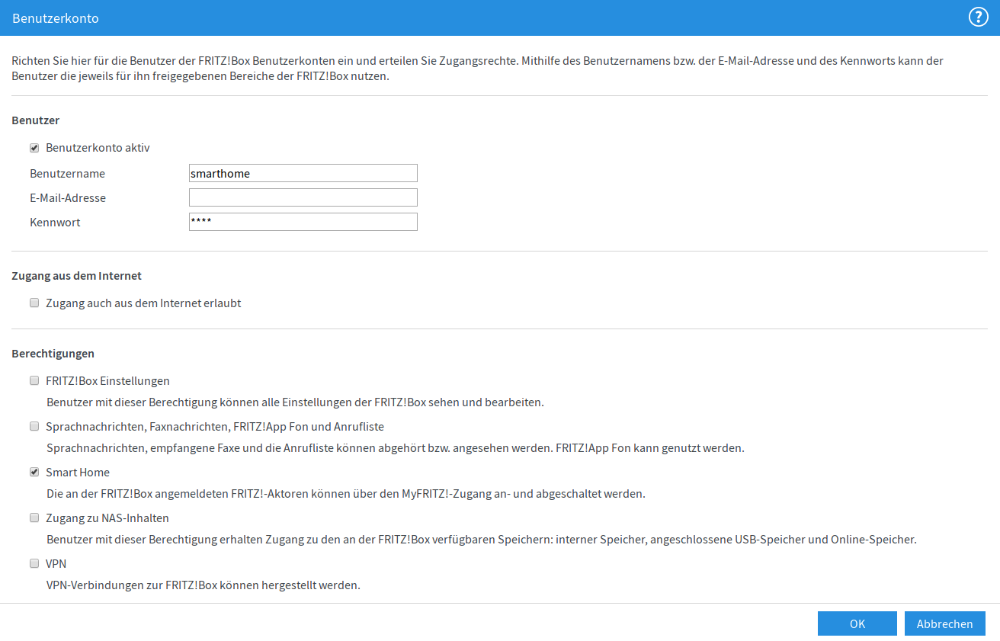

Python Library to access AVM Fritz!Box homeautomation
=====================================================

|BuildStatus| |PypiVersion| |PyPiPythonVersions| |Coveralls| |CodeClimate|

Tested Devices
--------------
* `FRITZ!Box 6490 Cable`_
* `FRITZ!Box 7590`_
* `FRITZ!DECT 200`_
* `FRITZ!DECT 302`_
* `FRITZ!DECT 440`_
* `FRITZ!DECT 500`_
* `Comet DECT`_
* `Panasonic KX-HNS101`
* `Magenta Smarthome Tür-/Fensterkontakt optisch`_
* `RADEMACHER RolloTron DECT 1213`_
* `Magenta Smarthome Zwischenstecker außen`_
* `Magenta SmartHome LED-Lampe E27 Warmweiß`
* `Magenta SmartHome Zwischenstecker innen`
* `Magenta Smarthome Tür-/Fensterkontakt magnetisch`

fritzhome CLI tool
------------------

You have to add a user with the rights to access the smarthome actors.

In the fritzbox webinterface under "System -> FRITZ!Box-Benutzer" you can
add a new user.

.. code:: shell

    $ fritzhome -f fritz.box  -u smarthome -p smarthome  list
    ##############################
    name=Fenster Badezimmer
      ain=11934 0154799-1
      id=2000
      productname=HAN-FUN
      manufacturer=0x0feb
      present=True
      lock=None
      devicelock=None
      is_group=False
     Alert:
      alert=True
    ##############################
    name=Thermostat Badezimmer
      ain=11959 0171328
      id=16
      productname=Comet DECT
      manufacturer=AVM
      present=True
      lock=False
      devicelock=False
      is_group=False
     Temperature:
      temperature=19
      offset=-3
     Thermostat:
      battery_low=False
      battery_level=80
      actual=19.0
      target=19.0
      comfort=22.0
      eco=19.0
      window=False
      window_until=0
      boost=None
      boost_until=None
      adaptive_heating_running=None
      summer=False
      holiday=False
    ##############################
    name=Wohnzimmer Couch
      ain=09995 0523646
      id=17
      productname=FRITZ!DECT 301
      manufacturer=AVM
      present=True
      lock=False
      devicelock=False
      is_group=False
    Temperature:
      temperature=20.5
    Thermostat:
      battery_low=False
      battery_level=80
      actual=20.5
      target=21.5
      comfort=21.5
      eco=17.5
      window=False
      summer=False
      holiday=False
    ##############################
    name=Wohnzimmer Tisch
      ain=09995 0517495
      id=18
      productname=FRITZ!DECT 301
      manufacturer=AVM
      present=True
      lock=False
      devicelock=False
      is_group=False
    Temperature:
      temperature=21.0
    Thermostat:
      battery_low=False
      battery_level=80
      actual=21.0
      target=21.5
      comfort=21.5
      eco=17.5
      window=False
      summer=False
      holiday=False
    ##############################
    name=Schalter WC Heizung
      ain=08761 0402392
      id=21
      productname=FRITZ!DECT 200
      manufacturer=AVM
      present=True
      lock=True
      devicelock=False
      is_group=False
     Switch:
      switch_state=False
     Powermeter:
      power=0
      energy=436529
      voltage=231.0
     Temperature:
      temperature=22
      offset=3
    ##############################
    name=Wohnzimmer
      ain=grp303E4F-3F7D9BE07
      id=900
      productname=
      manufacturer=AVM
      present=True
      lock=False
      devicelock=False
      is_group=True
      group_members=['17', '18']
    Thermostat:
      battery_low=None
      battery_level=None
      actual=None
      target=21.5
      comfort=21.5
      eco=17.5
      window=None
      summer=None
      holiday=None

Fritzbox User
-------------

Add a new user: System -> FRITZ!Box-Benutzer

.. image:: doc/fritzbox_user_overview.png

References
----------

- https://avm.de/fileadmin/user_upload/Global/Service/Schnittstellen/AHA-HTTP-Interface.pdf
- https://github.com/DerMitch/fritzbox-smarthome

.. |BuildStatus| image:: https://github.com/hthiery/python-fritzhome/actions/workflows/test.yml/badge.svg
                 :target: https://github.com/hthiery/python-fritzhome/actions/workflows/test.yml
.. |PyPiVersion| image:: https://badge.fury.io/py/pyfritzhome.svg
                 :target: http://badge.fury.io/py/pyfritzhome
.. |PyPiPythonVersions| image:: https://img.shields.io/pypi/pyversions/pyfritzhome.svg
                        :alt: Python versions
                        :target: http://badge.fury.io/py/pyfritzhome
.. |Coveralls|   image:: https://coveralls.io/repos/github/hthiery/python-fritzhome/badge.svg?branch=master
                 :target: https://coveralls.io/github/hthiery/python-fritzhome?branch=master
.. |CodeClimate| image:: https://api.codeclimate.com/v1/badges/fc83491ef0ae81080882/maintainability
                 :target: https://codeclimate.com/github/hthiery/python-fritzhome/maintainability
                 :alt: Maintainability

.. _Comet DECT: https://www.eurotronic.org/produkte/comet-dect.html
.. _FRITZ!DECT 200: https://avm.de/produkte/fritzdect/fritzdect-200/
.. _FRITZ!DECT 302: https://avm.de/produkte/fritzdect/fritzdect-302/
.. _FRITZ!DECT 440: https://avm.de/produkte/fritzdect/fritzdect-440/
.. _FRITZ!DECT 500: https://avm.de/produkte/fritzdect/fritzdect-500/
.. _FRITZ!Box 6490 Cable: https://avm.de/produkte/fritzbox/fritzbox-6490-cable/
.. _FRITZ!Box 7590: https://avm.de/produkte/fritzbox/fritzbox-7590/
.. _Magenta Smarthome Tür-/Fensterkontakt optisch: https://www.smarthome.de/geraete/smarthome-tuer-fensterkontakt-optisch-weiss
.. _RADEMACHER RolloTron DECT 1213: https://www.rademacher.de/shop/rollladen-sonnenschutz/elektrischer-gurtwickler/rollotron-dect-1213
.. _Magenta Smarthome Zwischenstecker außen: https://www.smarthome.de/geraete/smarthome-zwischenstecker-aussen-schwarz